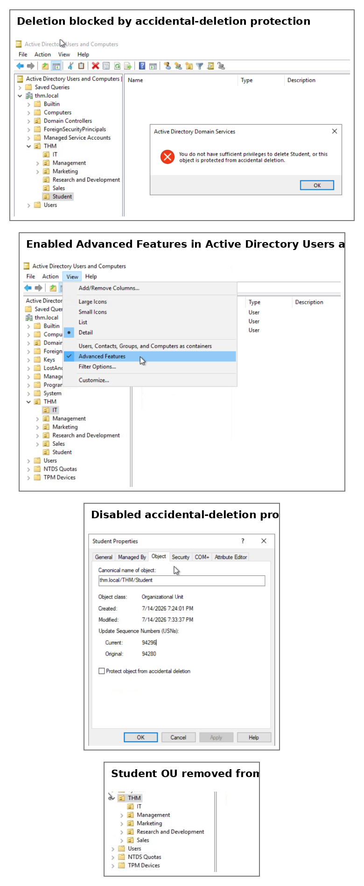
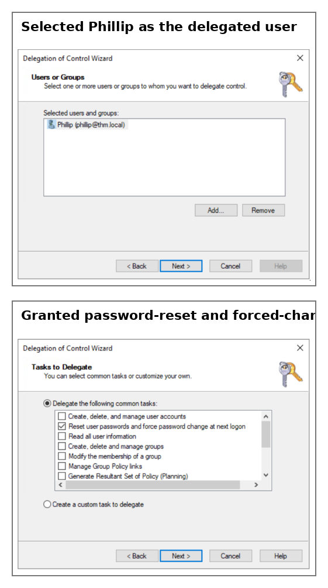
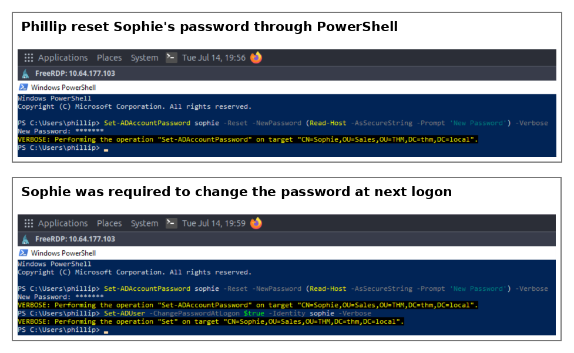
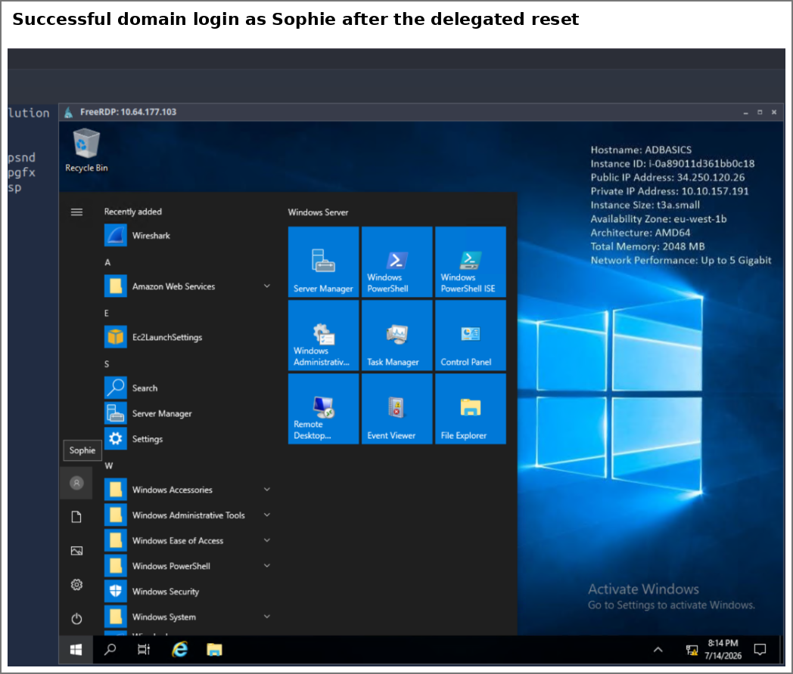
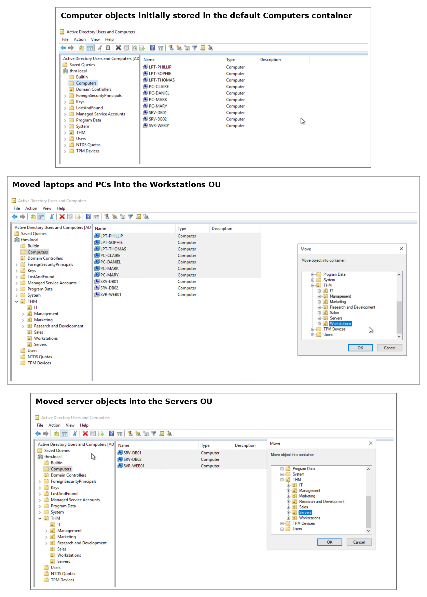
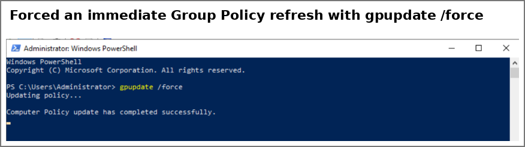
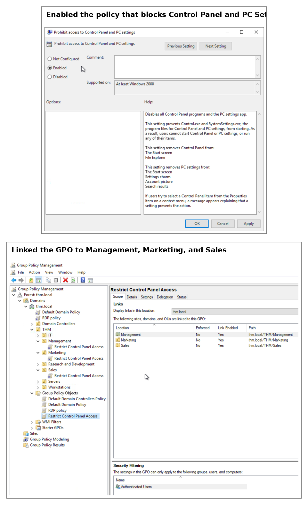
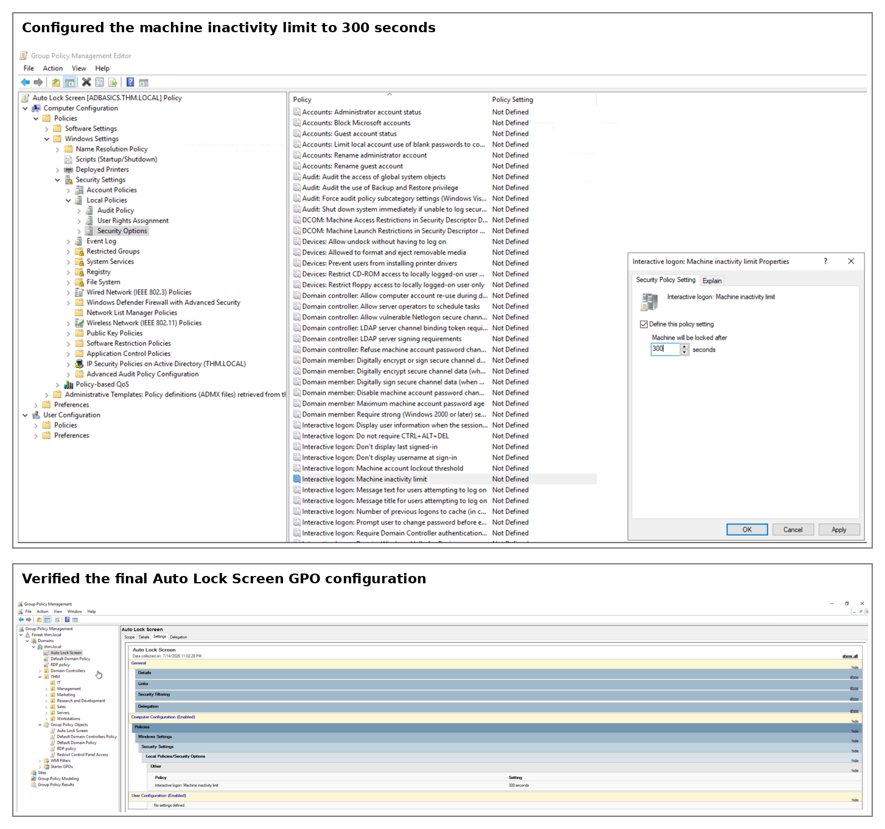

# Windows Active Directory Administration Lab

## Overview

I completed this lab to get hands-on experience with how a Windows domain is organized, secured, and managed. I worked directly with Active Directory Users and Computers, Group Policy Management, PowerShell, and Remote Desktop.

The main focus was cleaning up the domain structure, delegating limited permissions, organizing computer accounts, and applying security settings through Group Policy. I also reviewed how Kerberos and NetNTLM authentication work, along with Active Directory trees, forests, and trust relationships.

> This lab was completed in a controlled TryHackMe environment. Lab credentials, target addresses, and flags are not included.

## Environment and tools

| Area | Technology |
|---|---|
| Directory service | Active Directory Domain Services |
| Domain | `thm.local` |
| Administration | Active Directory Users and Computers |
| Policy management | Group Policy Management |
| Command line | Windows PowerShell |
| Remote access | FreeRDP and RDP |

## 1. Cleaning up the Active Directory structure

I started by comparing the existing Organizational Units and users with the provided company structure. The `Student` department no longer existed, but Active Directory prevented me from deleting its OU because it was protected from accidental deletion.

I enabled **Advanced Features**, opened the OU properties, and removed the accidental-deletion protection from the **Object** tab. I was then able to delete the unused OU and correct the remaining user structure.



This showed why deletion protection is enabled by default. Removing an OU can also remove the users, groups, and child OUs stored inside it, so the contents should always be reviewed first.

## 2. Delegating password-reset permissions

A Domain Administrator should not be required for every routine support task. I delegated a limited set of permissions over the Sales OU to Phillip, the IT support user.

Phillip was granted permission to reset passwords and force users to change their password at the next sign-in. He was not made a Domain Administrator and did not receive control over the entire domain.



This is a practical example of least privilege. The user receives only the access needed for a specific responsibility and only within the selected OU.

## 3. Testing the delegated access

I connected to the domain using Phillip's account and tested the delegated permissions through PowerShell.

```powershell
Set-ADAccountPassword sophie -Reset `
  -NewPassword (Read-Host -AsSecureString -Prompt "New Password") `
  -Verbose
```

I then forced Sophie to create a new password during her next sign-in.

```powershell
Set-ADUser -ChangePasswordAtLogon $true -Identity sophie -Verbose
```



The commands completed successfully against Sophie's account in the Sales OU. I then confirmed that the reset worked by signing in as Sophie.



## 4. Organizing domain computers

All non-domain-controller computers were originally stored together in the default `Computers` container. That makes it difficult to apply different security policies to servers and employee workstations.

I created separate `Workstations` and `Servers` OUs. Laptops and desktop PCs were moved into Workstations, while database and web servers were moved into Servers.



Separating these systems matters because a normal workstation and a server should not receive the same security baseline. The OU structure allows policies to be targeted based on each system's purpose.

## 5. Reviewing and updating domain policy

I reviewed the existing Default Domain Policy and its password, account lockout, and Kerberos settings. I updated the minimum password length requirement to 10 characters.

After changing policy settings, I forced the computer to retrieve the current policies instead of waiting for the normal background refresh.

```powershell
gpupdate /force
```



## 6. Restricting Control Panel access

I created a GPO named `Restrict Control Panel Access` and enabled:

```text
User Configuration
  Policies
    Administrative Templates
      Control Panel
        Prohibit access to Control Panel and PC settings
```

The policy was linked to the Management, Marketing, and Sales OUs. The IT OU was intentionally excluded so support personnel could continue accessing administrative settings.



This helped reinforce the difference between User Configuration and Computer Configuration. This policy follows the user account because it controls what the signed-in user is allowed to open.

## 7. Configuring automatic screen locking

I created another GPO named `Auto Lock Screen` and configured the machine inactivity limit to 300 seconds, which equals five minutes.

```text
Computer Configuration
  Policies
    Windows Settings
      Security Settings
        Local Policies
          Security Options
            Interactive logon: Machine inactivity limit
```



I linked this policy at the root domain so it could be inherited by the Workstations, Servers, and Domain Controllers OUs. User-only OUs ignore the computer setting because they do not contain computer objects.

## Authentication concepts reviewed

### Kerberos

Kerberos is the default authentication protocol for modern Windows domains. After a user authenticates, the Key Distribution Center provides a Ticket Granting Ticket. The user can then request a service ticket for a specific resource without repeatedly sending their password.

The process helped me understand the roles of the TGT, TGS, session keys, service accounts, and the `krbtgt` account.

### NetNTLM

NetNTLM uses a challenge-response process. The server sends a random challenge, the client calculates a response using information derived from the user's password, and the Domain Controller verifies the result.

The user's plaintext password is not sent across the network. NetNTLM is still present for compatibility, but Kerberos is preferred in modern domain environments.

## Trees, forests, and trusts

I also reviewed how Active Directory can expand beyond one domain.

A **tree** contains domains that share a namespace, such as `thm.local`, `uk.thm.local`, and `us.thm.local`.

A **forest** can contain multiple trees with different namespaces.

A **trust relationship** allows one domain to recognize users from another domain. The trust makes cross-domain authorization possible, but it does not automatically give every user access to every resource.

## What I learned

This lab gave me a clearer understanding of how identities, computers, permissions, and security policies are managed in an enterprise Windows environment.

The most useful parts were applying least privilege through delegation, separating computers into policy-ready OUs, and seeing how GPO scope and inheritance affect users and machines differently. These concepts are also important for security monitoring because suspicious Active Directory changes often involve privileged groups, delegated rights, password resets, authentication activity, or policy modifications.

## Next step

The next part of this project will focus on monitoring Active Directory activity and identifying security-relevant events. I plan to connect the administrative actions from this lab with the Windows logs and detection methods used to monitor them.
