# Monitoring Active Directory with Splunk

## Overview

I completed this lab to build hands-on experience monitoring Active Directory from a defensive perspective. I used Splunk to review Windows authentication events, account activity, group membership changes, logon behavior, and audit policy settings.

The main focus was learning how to separate normal high-volume domain activity from events that deserve investigation. I also correlated multiple Windows events to reconstruct a new employee's onboarding timeline.

> This lab was completed in a controlled TryHackMe environment. Lab credentials, target addresses, and flags are not included.

## Environment and tools

| Area | Technology |
|---|---|
| Directory service | Active Directory Domain Services |
| Log source | Windows Security Event Logs |
| SIEM | Splunk Enterprise |
| Authentication | Kerberos and NTLM |
| Policy review | Advanced Audit Policy Configuration |
| Command line | Windows PowerShell |

## 1. Understanding Active Directory traffic

Active Directory activity flows through several protocols. Understanding their purpose helps explain why certain events appear in the logs.

| Protocol | Common ports | Purpose |
|---|---:|---|
| Kerberos | 88 | Domain authentication and ticket requests |
| LDAP/LDAPS | 389, 636, 3268, 3269 | Directory searches and modifications |
| SMB | 445 | File sharing and remote administration |
| RDP | 3389 | Interactive remote administration |
| NetBIOS and LLMNR | 137, 138, 5355 | Legacy name-resolution fallback |

## 2. Domain users and local users

Domain users authenticate against the Active Directory database stored in `NTDS.dit` on the Domain Controller. Their domain authentication events can therefore be reviewed centrally on the DC.

Local users authenticate against the Security Account Manager database on the individual machine. Their events remain on that endpoint unless the logs are forwarded to a central platform.

This distinction matters because Domain Controller logs provide a wider view of domain-user activity, while local-account investigations may require evidence from a specific workstation or server.

## 3. Monitoring Kerberos authentication

Kerberos uses tickets so users can access domain resources without repeatedly sending their passwords across the network.

| Event ID | Activity | Logged on |
|---:|---|---|
| 4768 | Ticket Granting Ticket requested | Domain Controller |
| 4769 | Service ticket requested | Domain Controller |
| 4771 | Kerberos pre-authentication failed | Domain Controller |
| 4624 | Successful session created | Target system |

I reviewed Ticket Granting Ticket requests with:

```spl
index=* EventCode=4768
| table _time, Account_Name, Client_Address, Ticket_Encryption_Type
```

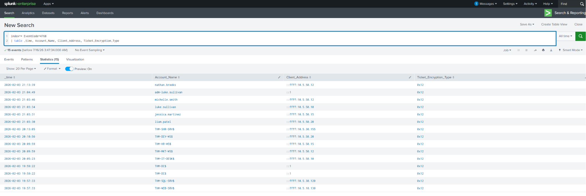

The results showed which account requested authentication, the source address, and the ticket encryption type. Common values included `0x12` for AES-256 and `0x17` for RC4-HMAC.

## 4. Monitoring NTLM authentication

NTLM is commonly used when Kerberos is unavailable. This can happen when a resource is accessed by IP address, DNS resolution fails, or a legacy application does not support Kerberos.

| Event ID | Activity | Logged on |
|---:|---|---|
| 4776 | NTLM credentials validated | Domain Controller |
| 4624 | Successful NTLM session | Target system |

I reviewed NTLM validation on the Domain Controller with:

```spl
index=* EventCode=4776
| table _time, Logon_Account, Source_Workstation
```

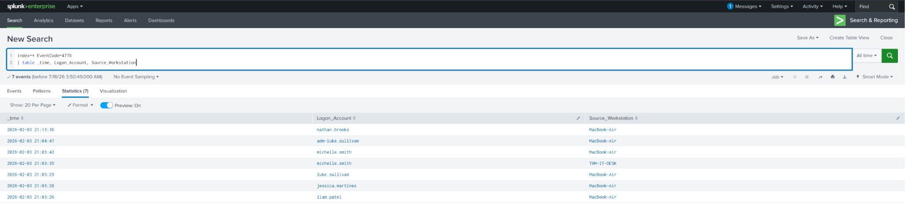

I then reviewed successful NTLM sessions on target systems:

```spl
index=* EventCode=4624 Account_Name=michelle.smith Authentication_Package=NTLM
| table _time, host, user, Workstation_Name, Source_Network_Address, Authentication_Package
```

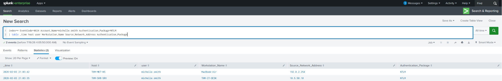

High NTLM usage can point to legacy applications, DNS issues, misconfigured systems, or resources being accessed by IP instead of hostname.

## 5. Monitoring the account lifecycle

Account lifecycle events show when users are created, enabled, reset, disabled, or locked out.

| Event ID | Activity |
|---:|---|
| 4720 | Account created |
| 4722 | Account enabled |
| 4724 | Password reset attempted |
| 4725 | Account disabled |
| 4740 | Account locked out |

I used the following query to identify newly created accounts and the administrator responsible:

```spl
index=* EventCode=4720
| table _time, SAM_Account_Name, Subject_Account_Name
```

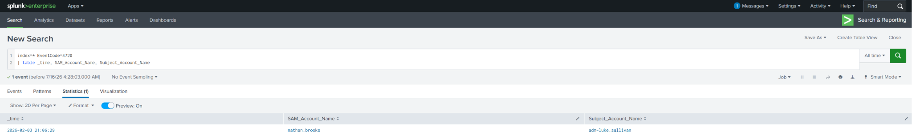

Unexpected account names, unusual creation times, or accounts created by an unauthorized administrator should be investigated.

## 6. Monitoring group membership and directory changes

Adding an account to a privileged group can provide elevated access or establish persistence. Windows records group membership changes with dedicated events.

| Event ID | Activity |
|---:|---|
| 4728 | Member added to a global security group |
| 4732 | Member added to a local or domain-local security group |
| 4756 | Member added to a universal security group |

I searched all three event types with:

```spl
index=* (EventCode=4728 OR EventCode=4732 OR EventCode=4756)
| table _time, Member_Account_Name, Group_Name, Subject_Account_Name
```

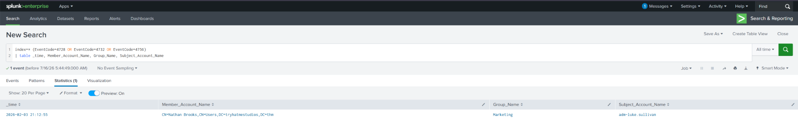

Event ID `5136` provides deeper visibility into attribute-level changes to Active Directory objects. It can show changes to attributes such as `userAccountControl`, `servicePrincipalName`, `scriptPath`, and `member`.

It can also identify changes to Group Policy Object metadata:

```spl
index=* EventCode=5136 Class="groupPolicyContainer"
| table _time, Subject_Account_Name, DN, LDAP_Display_Name, Value
| sort - _time
```

## 7. Reviewing successful logon activity

Windows records successful and failed authentication attempts with Event IDs `4624` and `4625`. The `Logon_Type` field explains how the session was created.

| Logon type | Meaning |
|---:|---|
| 2 | Interactive local logon |
| 3 | Network access |
| 4 | Batch process |
| 5 | Service logon |
| 7 | Workstation unlock |
| 10 | Remote Desktop session |

I reviewed successful logon types with:

```spl
index=* EventCode=4624
| stats count by Logon_Type
| sort -count
```

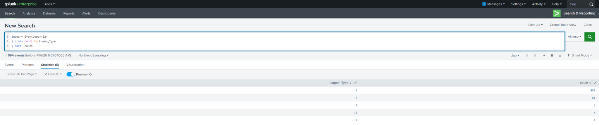

Network logons were the most common, which is expected because file sharing and remote administration generate large volumes of Type 3 events.

## 8. Establishing a normal baseline

Active Directory produces large amounts of normal activity. The goal is not to review every event individually, but to understand normal patterns and identify deviations.

Computer accounts end with `$` and often generate most Kerberos and logon activity through machine communication and automated processes.

I compared computer-account and user-account activity with:

```spl
index=* EventCode IN (4624, 4768, 4769)
| eval AccountType=if(like(Account_Name, "%$%"), "Computer Account", "User Account")
| stats count by AccountType, EventCode
| sort AccountType, -count
```

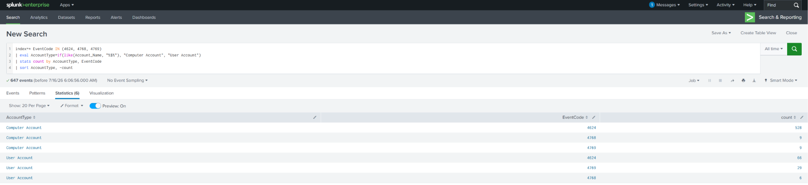

Filtering computer accounts helped reduce noise when the investigation was focused on human activity.

## 9. Using stack counting to find anomalies

Stack counting means counting how often each value appears, sorting by frequency, and reviewing rare activity at the bottom of the results.

I applied this technique to Kerberos service-ticket requests:

```spl
index=* EventCode=4769 NOT Account_Name="*$*"
| stats count by Account_Name
| sort -count
```

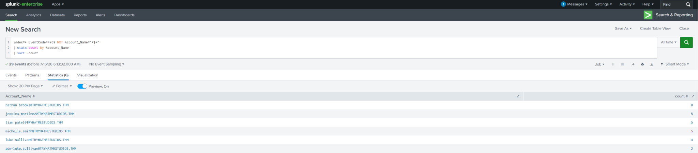

The same method can be applied to account names, client addresses, service names, encryption types, and workstations. Rare values are not automatically malicious, but they provide a practical starting point for investigation.

## 10. Reviewing audit policy configuration

Audit policies tell Windows which security activity to record. Without the correct settings, important Active Directory events may never appear in the logs.

Important audit subcategories include:

| Category | Subcategory | Setting | Events |
|---|---|---|---|
| Account Logon | Credential Validation | Success and Failure | 4776 |
| Account Logon | Kerberos Authentication Service | Success and Failure | 4768, 4771 |
| Account Logon | Kerberos Service Ticket Operations | Success and Failure | 4769 |
| Account Management | User Account Management | Success and Failure | 4720, 4722, 4724, 4725 |
| Account Management | Security Group Management | Success and Failure | 4728, 4732, 4756 |
| DS Access | Directory Service Changes | Success and Failure | 5136 |
| Logon/Logoff | Logon | Success and Failure | 4624, 4625 |
| Object Access | File Share | Success | 5140 |

I reviewed the current configuration with:

```powershell
auditpol /get /category:*
```

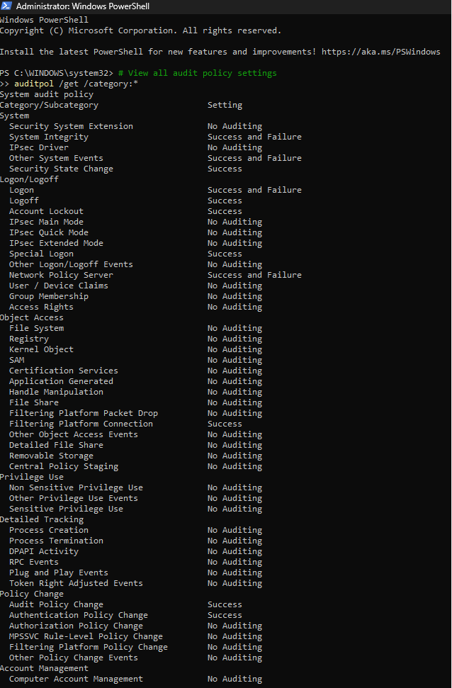

The results demonstrated how disabled categories can create gaps in security visibility.

## 11. Investigating new employee onboarding

The final scenario required auditing a newly created employee account. I correlated three separate events to reconstruct the timeline.

### Account creation

Event `4720` showed that `nathan.brooks` was created by `adm-luke.sullivan`.

```spl
index=* EventCode=4720
| table _time, SAM_Account_Name, Subject_Account_Name
```

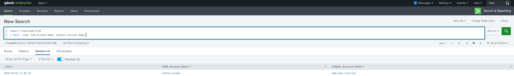

### Group assignment

A group membership event showed that the account was added to the `Marketing` security group by the same administrator.

```spl
index=* (EventCode=4728 OR EventCode=4732 OR EventCode=4756)
| table _time, Member_Account_Name, Group_Name, Subject_Account_Name
```

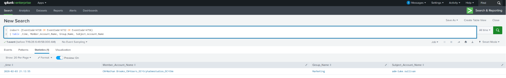

### First Kerberos authentication

Event `4768` showed the account's first Ticket Granting Ticket request from source address `10.5.50.12`.

```spl
index=* EventCode=4768 user=nathan.brooks
```

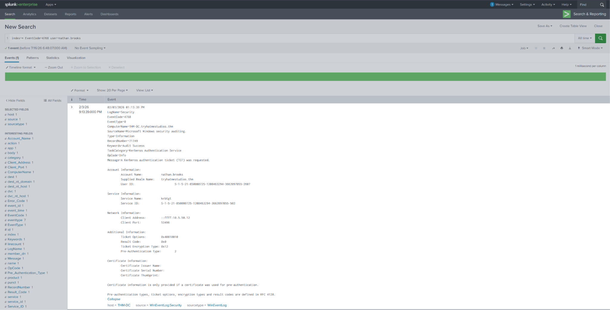

The sequence showed that the account was created, assigned to the correct department group, and then completed its first domain authentication. Correlating the events provided more context than reviewing any one event alone.

## What I learned

This lab gave me a clearer understanding of how Active Directory authentication and administrative activity appear in Windows Security logs.

The most useful parts were learning how Domain Controller and endpoint logs work together, using baseline and stack-counting techniques to reduce noise, and correlating separate events into a complete investigation timeline. It also reinforced that useful monitoring depends on properly configured audit policies.

## Skills demonstrated

- Splunk SPL querying
- Windows Event Log analysis
- Active Directory monitoring
- Kerberos and NTLM investigation
- Account lifecycle monitoring
- Security group change analysis
- Audit policy review
- Baseline development
- Stack counting and anomaly detection
- Event correlation and timeline reconstruction
